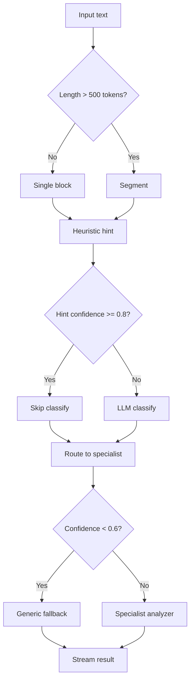

# MakeSense Improvement Plan

Based on evaluation of 30 test cases (avg **3.9/5**), web research on LLM orchestration patterns, and gaps vs. the existing product plan (`smart-notepad-plan.md`).

---

## Current State vs Target

```
TODAY (v0)                          TARGET (v1)
─────────────                       ─────────────
raw text                            raw text
    │                                   │
    ▼                                   ▼
single classifier                   segment into blocks
    │                                   │
    ▼                                   ├─ block 1 → classify → analyze
ONE specialist                      ├─ block 2 → classify → analyze
    │                                   └─ block N → ...
    ▼                                   │
one JSON blob                       stream multiple typed blocks
```

The product plan already describes the target architecture. Implementation stopped at step 2 of 5. This plan prioritizes closing that gap.

---

## Priority 0 — Quick Wins (1–3 days)

These improve scores without restructuring the pipeline.

### P0.1 Classifier prompt hardening

Add explicit rules to `classifierSystem` in `backend/internal/llm/prompts.go`:

| Rule | Fixes |
|------|-------|
| "If the text is a question asking about past data (how much, when did), classify as generic" | edge-004 |
| "If the text describes a meeting with owners/decisions/budget, classify as generic (not todo)" | gen-002 |
| "If negated ('don't need to', 'already done', 'no longer'), prefer generic over todo" | edge-001 |

**Expected impact:** edge cases +0.5–1.0 score; meeting notes routed correctly.

### P0.2 Expense analyzer: income exclusion

Add to `expensesSystem`:

```
- Do NOT record income (salary, refunds, money received) as expenses.
- Tag income mentions in flags if present but do not add to items/grand_total.
```

**Expected impact:** exp-008 passes fully.

### P0.3 Timeout and retry resilience

In `backend/internal/llm/openai.go`:

- Increase HTTP client timeout to 120s for FreeLLMAPI path
- Add 1 retry with backoff on timeout/502
- Surface user-friendly SSE error: "Analysis timed out — try again"

**Expected impact:** eliminate 7% hard errors in eval.

### P0.4 Pin a fast model for classification

FreeLLMAPI `auto` rotates providers — good for reliability, bad for latency (14.7s avg).

```
FREELLMAPI_MODEL_CLASSIFY=llama-3.1-8b-instant  # or groq equivalent
FREELLMAPI_MODEL_ANALYZE=llama-3.3-70b-versatile
```

Split `JSONGenerator` config so classifier uses a fast/cheap model and analyzers use a stronger one. Aligns with orchestration best practice: **route simple tasks to small models, complex extraction to large models** ([AIMultiple LLM Orchestration 2026](https://aimultiple.com/llm-orchestration)).

**Expected impact:** classify <2s, analyze <5s, ~60% cost reduction.

---

## Priority 1 — Segmentation Pipeline (1–2 weeks)

**Problem:** All mixed-content cases score ~3/5. Users naturally mix expenses, todos, and prose in one note.

**Solution:** Implement Step 1 from the product plan.

### P1.1 Text segmentation (rule-based first)

```go
// backend/internal/llm/segment.go
func Segment(text string) []Block {
    // Split on: double newline, markdown headings, "---", numbered sections
    // Merge very short fragments (<20 chars) with previous block
    // For text <500 tokens, return single block (fast path)
}
```

No LLM needed for initial segmentation — paragraph/bullet boundaries are sufficient for 80% of cases.

### P1.2 Multi-block classification

Replace single `Classify(text)` with:

```go
type BlockResult struct {
    Span       [2]int    // char offsets
    Type       BlockType
    Confidence float64
    Text       string
}

func (p *Pipeline) ClassifyBlocks(ctx context.Context, blocks []Block) ([]BlockResult, error)
```

One Haiku/fast call with all blocks, or parallel classify per block for long notes.

Schema:

```json
{
  "blocks": [
    { "index": 0, "type": "expenses", "confidence": 0.95 },
    { "index": 1, "type": "todo", "confidence": 0.88 }
  ]
}
```

### P1.3 Parallel specialist analysis

```go
func (p *Pipeline) AnalyzeAll(ctx context.Context, blocks []BlockResult) ([]AnalysisResult, error) {
    // errgroup: analyze each block concurrently
    // stream SSE events: block_classified, block_done
}
```

### P1.4 Frontend: multi-block rendering

Update `AnalysisPane.tsx` to render an array of typed blocks (expense table + todo checklist stacked), not a single view.

**Expected impact:** mixed cases 3.0 → 4.5+/5; aligns with product differentiator.

---

## Priority 2 — New Analyzer Types (2–3 weeks)

Expand beyond `expenses | todo | generic`:

| Type | Trigger patterns | Structured output | Eval case |
|------|-----------------|-------------------|-----------|
| `meeting_notes` | owners, deadlines, decisions, "Q1/Q2", budget | `{participants, decisions[], action_items[], risks[]}` | gen-002 |
| `plan` | milestones, phases, timelines | `{milestones[], dependencies[]}` | mix-003 |
| `journal` | first-person reflection, emotions | `{summary, themes, emotions[], open_questions[]}` | gen-001 |

Start with **meeting_notes** — highest misclassification rate in eval (gen-002 scored 1.5/5).

Classifier enum grows but each specialist prompt stays focused (LMUnit principle: one quality dimension per analyzer).

---

## Priority 3 — Hybrid Intent Detection (2 weeks)

Research pattern from [ai-pipeline-orchestrator](https://github.com/emmanuel-adu/ai-pipeline-orchestrator): **keyword fast-path → LLM fallback**.

### P3.1 Pre-classifier heuristics (zero LLM cost)

```go
func HeuristicHint(text string) (BlockType, float64) {
    // ₹/$/Rs + digits → expenses hint (0.6)
    // "- [ ]" or "TODO:" → todo hint (0.7)
    // "?" at end, "how much" → generic/query hint (0.8)
    // "meeting", "decided", "owner:" → meeting hint (0.6)
}
```

If hint confidence ≥ 0.8, skip LLM classify. If 0.5–0.8, pass hint to LLM as context. If < 0.5, LLM only.

### P3.2 Hierarchical classification

Two-stage (per [Murga, Intent Classification in Agentic Apps](https://medium.com/@mr.murga/enhancing-intent-classification-and-error-handling-in-agentic-llm-applications-df2917d0a3cc)):

1. **Top level:** `structured_data | prose | query | code`
2. **Second level:** structured → expenses/todo/contacts; prose → journal/meeting/research

Reduces confusion between meeting notes (structured prose) and todos (structured data).

---

## Priority 4 — Orchestration Architecture (3–4 weeks)

### P4.1 Pipeline as explicit DAG

Model the flow as a state machine (LangGraph-style) rather than linear calls:



Benefits: observable stages, per-step retry, easy to add analyzers as new nodes.

### P4.2 Interactive pipeline adjustment (AOP-inspired)

From [AOP paper (CIDR 2025)](https://dbgroup.cs.tsinghua.edu.cn/ligl/papers/CIDR25-AOP.pdf): after each stage, evaluate intermediate output and adjust.

Example: if expense analyzer returns empty items but classifier said expenses with 0.9 confidence → re-classify as generic before returning to UI. Prevents edge-004 empty table UX.

### P4.3 Incremental re-analysis

Product plan: diff note snapshots, only re-analyze changed blocks.

```go
func (p *Pipeline) AnalyzeDiff(ctx context.Context, oldText, newText string, prev []AnalysisResult) ([]AnalysisResult, error)
```

Hash each block; skip unchanged. **70–90% cost savings** on edits (already in plan, not implemented).

---

## Priority 5 — Quality & Observability (ongoing)

### P5.1 CI eval gate

```yaml
# .github/workflows/eval.yml
- run: python3 tests/scripts/run_evaluation.py --api ${{ env.API_URL }}
- run: |
    score=$(jq .avg_score tests/results/latest.json)
    test $(echo "$score >= 3.5" | bc) -eq 1
```

Block regressions on PRs that touch `prompts.go` or `pipeline.go`.

### P5.2 LLM tracing

Add Langfuse or Helicone proxy (mentioned in product plan) to log:
- classify latency / model / tokens
- analyzer accuracy flags
- cache hit rate

Enables A/B testing prompt changes against the eval suite.

### P5.3 Expand eval suite

Add cases from Checklist patterns:
- **Invariance:** same meaning, different words → same classification
- **Negation battery:** 10 variants of "don't X"
- **Fairness:** names/places shouldn't change category
- **Long notes:** 2000+ word stress test

Target: 100 cases before v1 launch.

---

## Recommended Implementation Order

| Phase | Work | Duration | Score target |
|-------|------|----------|--------------|
| **Sprint 1** | P0.1–P0.4 prompt/timeout/model fixes | 3 days | 4.2/5 |
| **Sprint 2** | P1 segmentation + multi-block API/UI | 2 weeks | 4.5/5 |
| **Sprint 3** | P2 meeting_notes analyzer | 1 week | 4.6/5 |
| **Sprint 4** | P3 hybrid intent + P4.2 adjustment loop | 2 weeks | 4.7/5 |
| **Sprint 5** | P4.3 incremental + P5 CI eval | 1 week | 4.8/5 stable |

---

## Architecture Target (v1)

```
Browser
   │ debounced text
   ▼
Go API (/api/analyze/stream)
   │
   ├─► Segment (rules)
   ├─► Heuristic hints (rules, free)
   ├─► Classify blocks (fast model, ~1s)
   ├─► Adjust pipeline (confidence gates)
   ├─► Analyze blocks in parallel (strong model, ~3s)
   └─► Stream typed blocks via SSE
          │
          ▼
   Frontend renders:
   [Expense table]
   [Todo checklist]
   [Meeting summary]
```

### New env vars

| Var | Purpose |
|-----|---------|
| `LLM_MODEL_CLASSIFY` | Fast model for classification |
| `LLM_MODEL_ANALYZE` | Strong model for extraction |
| `SEGMENT_THRESHOLD` | Token count above which to segment (default 500) |
| `CLASSIFY_CONFIDENCE_MIN` | Fall through to generic below this (default 0.6) |
| `HEURISTIC_ENABLED` | Toggle keyword pre-classifier (default true) |

---

## What NOT to do yet

- **Don't add 10 analyzer types at once** — each needs eval cases and UI component
- **Don't replace rules with embeddings** — segmentation heuristics are cheaper and sufficient for v1
- **Don't build a generic agent** — the product wins on typed, zero-prompt structure, not chat
- **Don't optimize for 100% accuracy** — aim for useful output with flags on ambiguity; perfect extraction is impossible on casual input

---

## References

- [Checklist — Beyond Accuracy (Ribeiro et al.)](https://github.com/marcotcr/checklist) — systematic NLP testing
- [LMUnit — natural language unit tests](https://github.com/ContextualAI/examples) — response quality dimensions
- [AOP — Automated Pipeline Orchestration for LLMs (CIDR 2025)](https://dbgroup.cs.tsinghua.edu.cn/ligl/papers/CIDR25-AOP.pdf) — dynamic pipeline adjustment
- [ai-pipeline-orchestrator](https://github.com/emmanuel-adu/ai-pipeline-orchestrator) — hybrid intent + sequential handlers
- [LangGraph](https://www.langchain.com/langgraph) — stateful DAG orchestration
- [LLM Orchestration 2026 (AIMultiple)](https://aimultiple.com/llm-orchestration) — task decomposition, model routing
- Internal: `smart-notepad-plan.md` sections 4–5

---

## Success Metrics

| Metric | Now | v1 Target |
|--------|-----|-----------|
| Eval avg score | 3.9/5 | ≥ 4.5/5 |
| Mixed-content score | 3.0/5 | ≥ 4.5/5 |
| P95 latency (uncached) | ~45s | < 5s |
| Error rate | 7% | < 1% |
| Cache hit rate (typing) | unknown | > 60% |

Run `python3 tests/scripts/run_evaluation.py` after each sprint to track progress.
